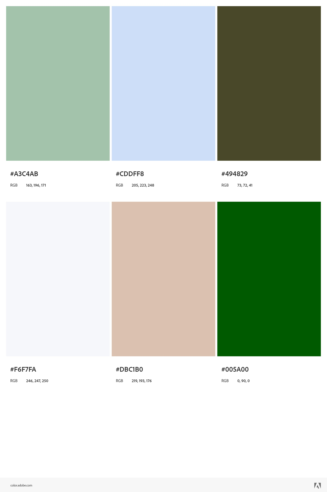

# README

Emily Lubonty

## Description
The About Me project's purpose is to allow users to develop their own portfolio style website. In each section different aspects of HTML and CSS are used to demonstrate the functionality of web development. 

**NavBar**

The navigation bar at the top demonstrates how attributed links can lead the user to the desired locations throughout the website. By linking a reference point within the code, a hyperlink can be created making it easier for the user to navigate the website. For example, clicking on the "Bio" option will lead to the biography section of the website. This section makes it easier for users to find what they are looking for rather than endlessly searching through the website. 

**Hero**

The hero of the About Me project focuses on the author's main biographical information. This section includes the name, location, and profile image. It is followed by the bio section which includes more personal details such as background information. In this section an image was included and linked to CSS to demonstrate how an image can be altered or styled differently. 

**Photo Gallery**

The photo gallery section demonstrates how flexbox is used to style elements effectively on a webpage. By using flexbox and media states, the photos adjust to different screen sizes so they will fit and display properly. Flexbox also allows photos and figcaptions to be formatted for the appropriate displays, such as phones versus desktop screens. 

**Video**

The video section includes a video using the iframe attribute. This allows an external video (such as a YouTube video) to be linked within the webpage. The user does not have to leave the website in order to view the video nor switch screens or tabs. A figcaption is included to provide a legend or information on what the video entails. 

**Article** 

This section includes user-written content including (but not limited to) blogs, forum posts, or articles from magazines or publications. 

**Contact Form**

The contact form allows users to fill out a form regarding contact information. By using Netlify's contact form, data submitted by the user is sent to Netlify's servers allowing it to be saved and viewed by the web host. The contact form demonstrates different kinds of features commonly seen while filling out applications, such as drop down menus, radio buttons, and a scroll-bar for the message box. 

## Color Scheme

`#A3C4AB`

`#CDDFF8`

`#494829`

`#F6F7FA`

`#DBC1B0`

`#005A00`

## Citations

Barcelona Field Studies Centre. "How to Get your Google Maps API Key (Tutorial)". *Google Maps Compass Application*. https://setcompass.com/How-to-Get-Google-Maps-API-Key-Guide.htm

Google Maps Platform. "The Maps Embed API overview". https://developers.google.com/maps/documentation/embed/get-started

W3 Schools. "Google Maps Tutorial". https://www.w3schools.com/graphics/google_maps_intro.asp. 

## Licensing 

